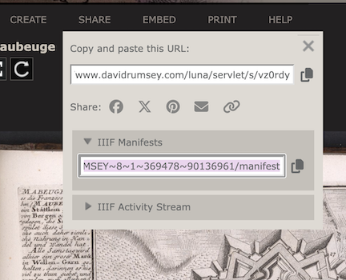





## Georeferencing

[Georeferencing](https://en.wikipedia.org/wiki/Georeferencing) describes the process of overlaying scanned map images on their real-world locations. While this practice emerged as a way of transforming aerial and satellite photography into spatial data, it's commonly used to place historic maps on modern ones and compare change over time.

The core principle behind georeferencing is the creation of **control points**. Control points correlate the pixels in source imagery with geographic coordinates in the real world.

A simple control point pair might resemble:

```csv
xy,           latlon
[9222,2190],  [-70.93986,42.46188]
```

This is kind of confusing, but it's a pair of pairs: the `xy` pair `[9222,2190]` specifies the location of a control point on an image, while the `latlon` pair `[-70.93986,42.46188]` specifies the corresponding location in geographic space (e.g., latitude and longitude).

If you create enough control points, you can overlay a map in geographic space. The software will overlay it for you, based on the spatial transformation algorithm that you want to use.

For standard transformations (like a "polynomial" transformation), 3-4 control points should suffice. More complex transformation algorithms (like "thin plate spline) require more points.

Below, check out a georeferenced urban atlas from the Leventhal Center's collections:

<iframe src="https://viewer.allmaps.org/?url=https%3A%2F%2Fannotations.allmaps.org%2Fmanifests%2F23379602e8187445" width=100% height=500px></iframe>

This atlas is georeferenced and displayed in a tool called **Allmaps**, which we'll talk more about soon.

## Why georeference?

Georeferencing scanned maps enables powerful spatial analysis. For example, you can:

1. Extract information from a map, such as locations of topographic features like villages, mountains, rivers, or roads
2. Compare or verify features by overlaying two maps
3. Create a *mosaic* for viewing multiple sheets at once in large map series

The Leventhal Center uses georeferencing of urban atlases in our [Atlascope](https://atlascope.org) tool.

Our team has georeferenced and mosaiqued over **157** urban atlases in the greater Boston area, making it easy to compare change over time across dozens of Massachusetts towns. Try it out below:

<iframe src="https://atlascope.org" width=100% height=500px></iframe>

Elsewhere, the [American Geographical Society Library](https://uwm.edu/libraries/agsl/) (AGSL) at the University of Wisconsin-Milwaukee used Sanborn fire insurance maps to create a [Sanborn Web Map](https://webgis.uwm.edu/agsl/sanborn/). They've also georeferenced aerial photography in their [Operation Birds Eye](https://uwm.maps.arcgis.com/apps/webappviewer/index.html?id=4e066bb8e5664d189ac3e77c26d21712) discovery application.

<iframe src="https://uwm.maps.arcgis.com/apps/webappviewer/index.html?id=4e066bb8e5664d189ac3e77c26d21712" width=100% height=400px></iframe>

<!-- <a href="https://uwm.maps.arcgis.com/apps/webappviewer/index.html?id=4e066bb8e5664d189ac3e77c26d21712" target="blank">


</a> -->

## Georeferencing methods

Traditional georeferencing involves **GIS** or "geographic information systems."

Georeferencing in GIS requires downloading software (like QGIS or ArcGIS Pro), uploading source files to the software, creating the . For more detailed background, see [*Georeferencing and Georectification*](https://gistbok-topics.ucgis.org/DC-01-030) in the GIS&T Body of Knowledge.

Thanks to modern web-mapping tools, the process of georeferencing is more accessible to non-experts. For instance, the platform [OldInsuranceMaps.net](https://oldinsurancemaps.net/)---designed and built by Adam Cox---provides an interface for crowdsourced georeferencing of Sanborn maps across the entire United States.

<a href="https://docs.oldinsurancemaps.net/getting-started/georeferencing" target="blank">


</a>

This workshop uses [Allmaps](https://allmaps.org), a web-based georeferencing tool, to get started with georeferencing. The Allmaps software depends on something called [IIIF](https://iiif.io)---but what does *that* mean?

## IIIF review

As discussed in the [first lesson](../../posts/1-iiif), **IIIF** describes a set of open standards for delivering high-quality, attributed digital objects across the web. IIIF provides a consistent way for institutions to share digital images, maps, manuscripts, artworks, and even audio/visual files across different platforms. Rather than locking media inside specific viewers or software tools, IIIF offers a standardized, flexible method for delivering these resources to any compatible application.

This means:

1. A digitized map from one library can be viewed side-by-side with one from another institution.
2. A scholar can annotate or compare high-resolution images without downloading large files.
3. Tools like [Mirador](https://projectmirador.org/) and [Universal Viewer](https://universalviewer.io/) can all read the same IIIF content.

At its core, IIIF enables *interoperability*, making it easier for cultural heritage institutions, educators, and developers to build rich user experiences around media from all over the world.

## IIIF-powered georeferencing

**Allmaps** is a IIIF-powered georeferencing software. To use it, you don't have to download any software, upload any images, or learn how to use a geographic information system. All you need is a IIIF Manifest, and you can warp maps directly in a web browser. To read more about the Allmaps project, [check out the main site](https://allmaps.org).

This workshop focuses on two applications in the Allmaps platform: **Editor** and **Viewer**.

[Allmaps Editor](https://editor.allmaps.org) provides an interface for creating control points and overlaying IIIF maps in the real world. When you open the webpages, you'll see maps hosted by various Allmaps partners that are waiting to be georeferenced. [Allmaps Viewer](https://viewer.allmaps.org) provides an application for viewing georeferenced IIIF maps.

We'll talk more about both of these in the next lesson.

## Finding IIIF maps

You can use Allmaps to georeference any IIIF map.

To georeference a map from the Leventhal Center, simply pick a map from the [Center's digital collections portal](https://collections.leventhalmap.org/) and select "Georeference this map" on the right-hand side of the screen.



Other websites may require more sleuthing to find the manifest. On the David Rumsey Collection, for instance, the IIIF manifest is listed under the **share** menu:

The [DetektIIIF browser extension](https://seige.digital/en/detektiiif/) is an exceptional resource for quickly identifying the IIIF Manifest on any given page.

Finally, the Allmaps project publishes a running list of [IIIF map collections](https://github.com/allmaps/iiif-map-collections/blob/main/iiif-map-collections.yml), which is a great starting point for finding IIIF maps.

